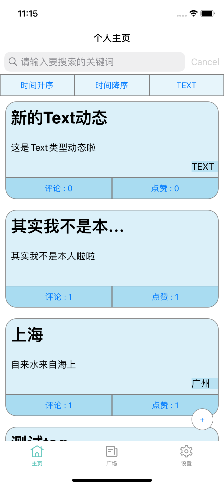
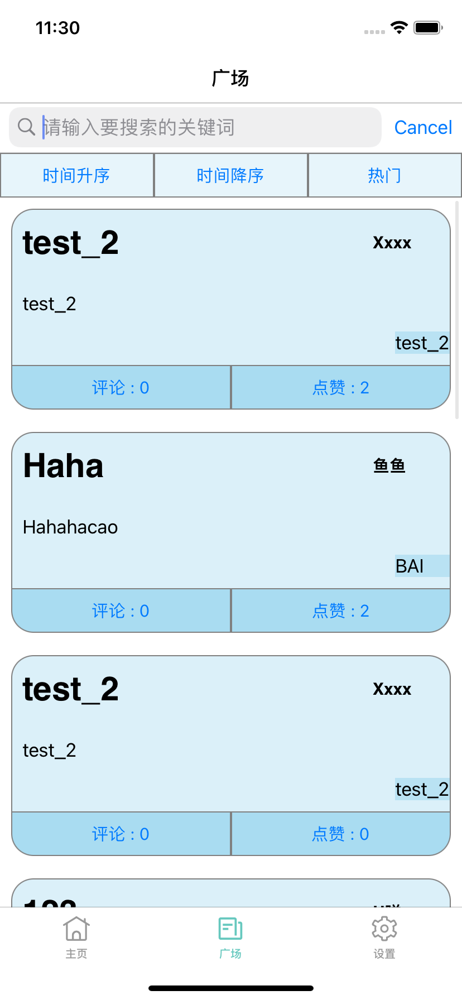

# CampusCircleA-APP-IOS

## 封面

### 开发成员
- 颜府
- 郑卓民
- 许淼泳

### 应用名

校园圈子

### logo


## 程序运行截图

下面只展示三个主要页面的截图：

|个人主页|广场|设置中心|
|:--:|:--:|:--:|
||||

## 采用的技术

1. 基础UI控件布局与交互
2. 界面动画实现
3. 异步网络请求。

## 成员贡献表和Git提交记录

终端执行以下命令，即可统计行数的增减。这里统计的是项目正式开始以后，写实验报告之前的数据。

- 杨文里：颜府
- student12：郑卓民
- xumy：许淼泳

```shell
student12s-Mac-mini:mosad_hw_mid yan$ git log --format='%aN' | sort -u | while read name; do echo -en "$name\t"; git log 0c998c0..30bc3af --author="$name" --pretty=tformat: --numstat | awk '{ add += $1; subs += $2; loc += $1 - $2 } END { printf "added lines: %s, removed lines: %s, total lines: %s\n", add, subs, loc }' -; done
KatherineJY	added lines: 205, removed lines: 0, total lines: 205
ciaoSora	added lines: , removed lines: , total lines: 
student12	added lines: 5192, removed lines: 646, total lines: 4546
xumy	added lines: 726, removed lines: 165, total lines: 561
杨文里	added lines: 18417, removed lines: 15117, total lines: 3300
```

## 应用部署方法

首先把仓库clone到本地仓库，进到`code/Group23/G23/`目录（这个是项目目录）下，终端执行`pod install`，然后`open G23.xcworkspace`，这将会打开Xcode。在Xcode中，模拟器选iPhone11，编译运行即可。

## 应用测试结果

进行功能测试，可见MP4视频: 位于当前目录下的`演示视频.mp4`

[视频链接](./演示视频.mp4)
