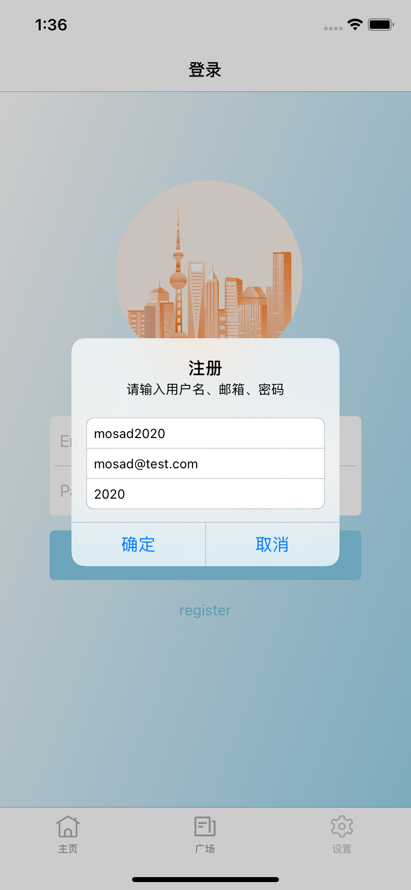
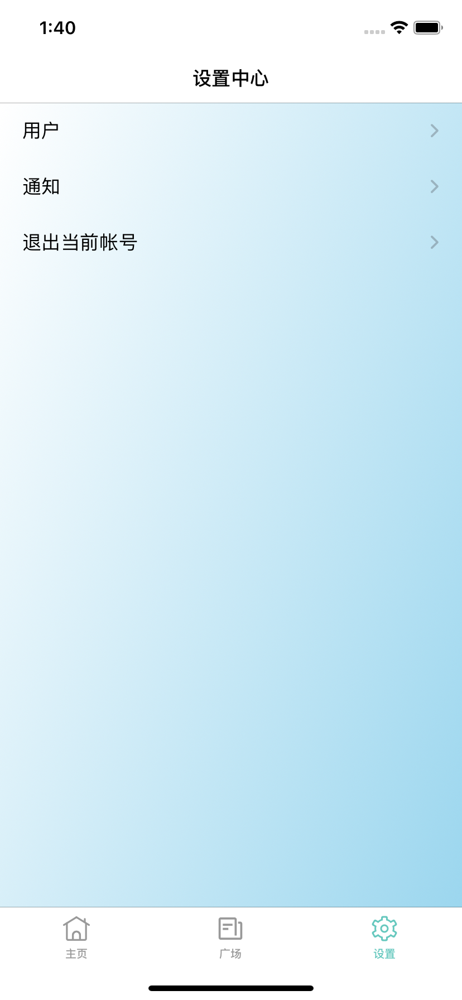
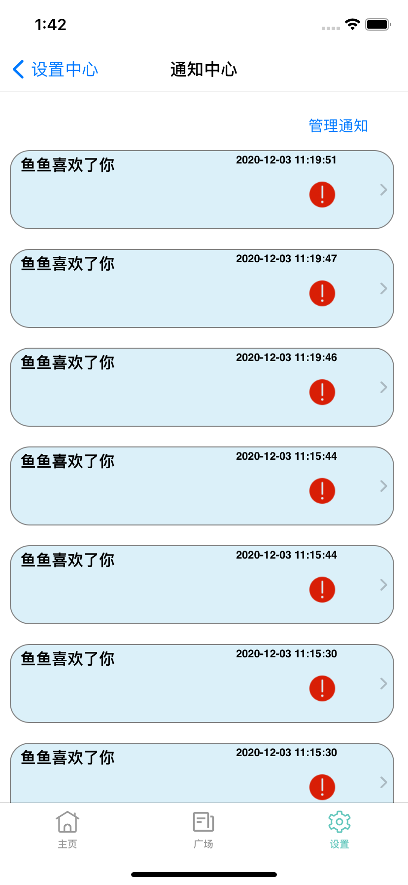
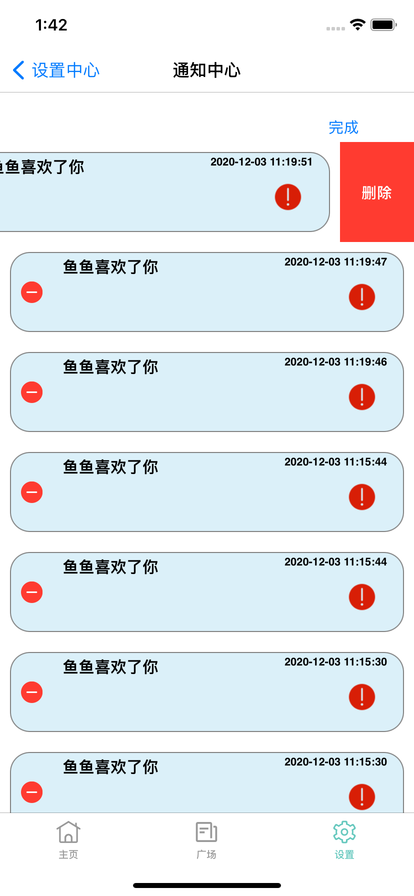
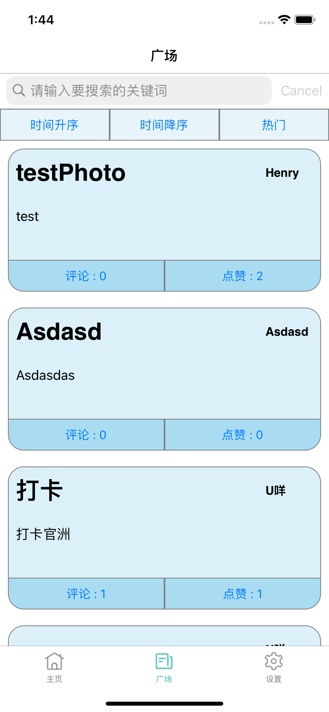
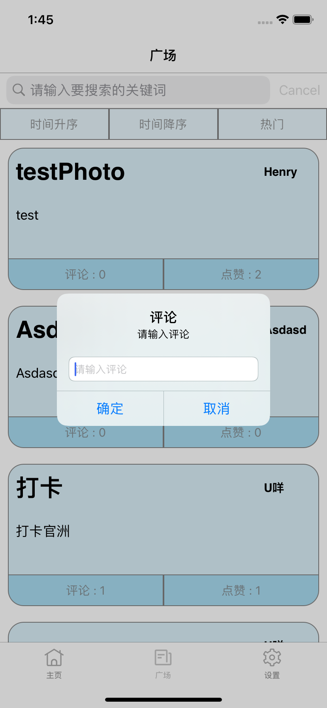
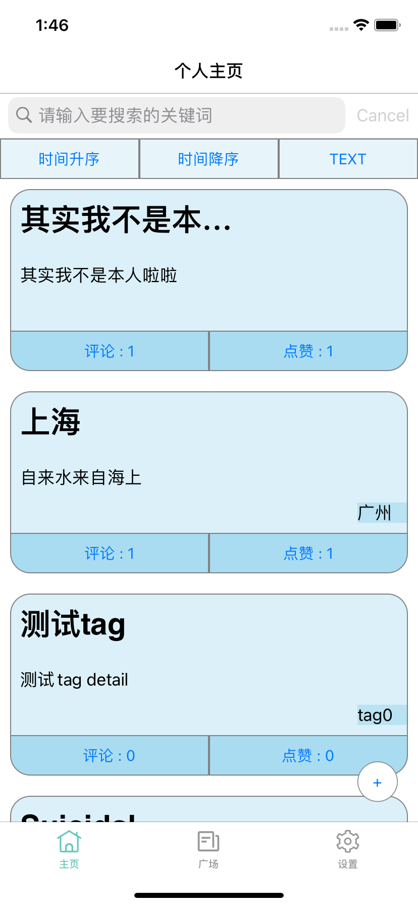
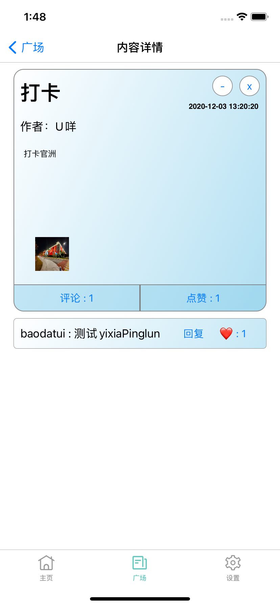
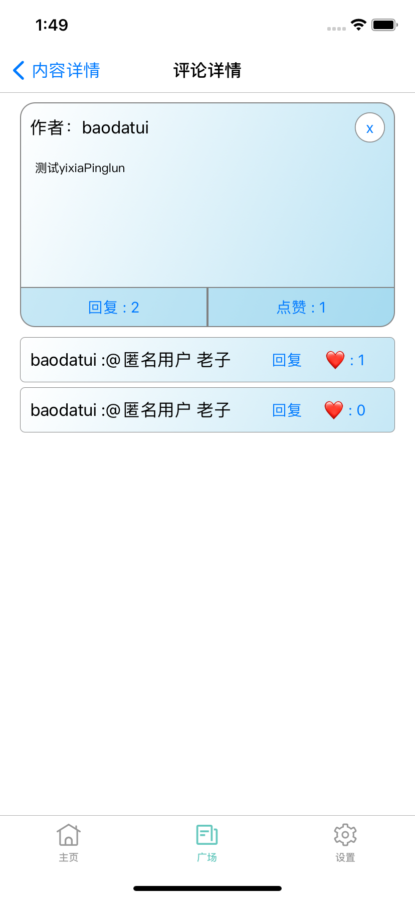
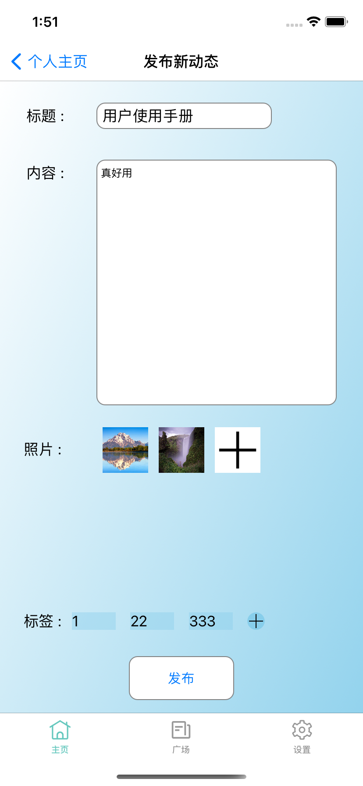

# 校园圈子APP————用户使用手册

## 软件概述

### 概述

功能比较完善的Feeds信息流校园资讯App

### 功能

- 简单的匹配搜索
- 可以嵌套回复的评论系统
- 全局唯一的点赞系统
- 简单的基本回复通知系统
- 简单的空间分配系统
- 简单的文件存储系统
- 初步建立内容标签系统
- 文本内容模块
- 相册内容模块
  - 图片缩略图预览
  - 高清大图下载

### 性能

软件具有良好的易用性和可靠性，并保证信息的安全性和可靠性。

### 运行环境

本软件可在IOS手机上运行。

## 使用方法

### 用户注册

1. 点击register按钮
2. 输入名字、邮箱、密码
3. 点击注册

### 用户登录

1. 输入邮箱和密码
2. 点击login按钮
3. 成功登录或登录失败

### 查看用户个人信息或通知

设置中心中点击“用户“或“通知”

用户个人信息页面可点击修改按钮对名字进行修改

通知页面可通过管理通知按钮进行删除通知，通过点击红感叹号进行已读标记

### 退出登录

设置中心中点击”退出当前账号“

### 广场查看动态

- 可通过搜索框进行搜索关键词
- 可通过时间升降序按钮以及热门按钮进行排序

- 可通过评论、点赞按钮进行快速评论点赞
- 可点击动态进入详情

### 个人主页查看动态

- 可通过搜索框进行搜索关键词
- 可通过时间升降序按钮进行排序
- 可通过TEXT/ALBUM按钮进行切换文本动态和相片动态

### 动态详情页

- 点击主页或广场中的动态进入详情页
- 可评论、回复、点赞、修改、删除、查看大图、保存大图。

### 评论详情页

- 点击评论进入详情页
- 可回复、点赞、删除

### 发布动态页

- 点击个人主页下的加号进入发布动态页
- 添加完毕内容后发布

